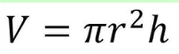

# Assignment 8 – Cylinder CRUD Microservice

**Author:** Jordan Broomfield
**Course:** CSCI 487 - Software Design and Develoment
**Instructor:** Benjamin Standfield

---

## 📌 Project Overview

This project implements a full **CRUD microservice** for managing **Cylinder** geometric entities.The microservice is built using **ASP.NET Core Web API** following a **clean architecture**:

- **Domain** – Entities + Interfaces
- **Application** – Business logic + Services
- **Infrastructure** – In-memory Repositories
- **Presentation** – Web API Controllers

The API supports:

- Creating a cylinder
- Retrieving all cylinders
- Getting a cylinder by ID
- Updating a cylinder
- Deleting a cylinder

Volume and surface area are automatically calculated for every cylinder.

---

## 🚀 How to Run the Project

### ▶️ Option 1 — Run with .NET CLI

In the terminal:

```bash
cd src/Geometry.Presentation
dotnet run
```

Swagger UI will open at:

<pre class="overflow-visible!" data-start="1153" data-end="1190"><div class="contain-inline-size rounded-2xl relative bg-token-sidebar-surface-primary"><div class="sticky top-9"><div class="absolute end-0 bottom-0 flex h-9 items-center pe-2"><div class="bg-token-bg-elevated-secondary text-token-text-secondary flex items-center gap-4 rounded-sm px-2 font-sans text-xs"></div></div></div><div class="overflow-y-auto p-4" dir="ltr"><code class="whitespace-pre!"><span><span>http://localhost:5079/swagger</span></span></code></div></div></pre>

### ▶️ Option 2 — Run with Docker Compose

In the terminal:

<pre class="overflow-visible!" data-start="1470" data-end="1507"><div class="contain-inline-size rounded-2xl relative bg-token-sidebar-surface-primary"><div class="sticky top-9"><div class="absolute end-0 bottom-0 flex h-9 items-center pe-2"><div class="bg-token-bg-elevated-secondary text-token-text-secondary flex items-center gap-4 rounded-sm px-2 font-sans text-xs"></div></div></div><div class="overflow-y-auto p-4" dir="ltr"><code class="whitespace-pre! language-bash"><span><span>docker-compose up --build
</span></span></code></div></div></pre>


## ▶️ Option 3 — Run the Cube API Directly

Runs the **CubeApi Web API** without using Docker.

In the terminal:

<pre class="overflow-visible!" data-start="432" data-end="498"><div class="contain-inline-size rounded-2xl relative bg-token-sidebar-surface-primary"><div class="sticky top-9"><div class="absolute end-0 bottom-0 flex h-9 items-center pe-2"><div class="bg-token-bg-elevated-secondary text-token-text-secondary flex items-center gap-4 rounded-sm px-2 font-sans text-xs"></div></div></div><div class="overflow-y-auto p-4" dir="ltr"><code class="whitespace-pre! language-bash"><span><span>dotnet run --project src/Geometry.Presentation/CubeApi
</span></span></code></div></div></pre>

Once the API starts, it will display something like:

<pre class="overflow-visible!" data-start="554" data-end="601"><div class="contain-inline-size rounded-2xl relative bg-token-sidebar-surface-primary"><div class="sticky top-9"><div class="absolute end-0 bottom-0 flex h-9 items-center pe-2"><div class="bg-token-bg-elevated-secondary text-token-text-secondary flex items-center gap-4 rounded-sm px-2 font-sans text-xs"></div></div></div><div class="overflow-y-auto p-4" dir="ltr"><code class="whitespace-pre!"><span><span>Now</span><span> listening </span><span>on</span><span>: http://localhost:5079
</span></span></code></div></div></pre>

### 🌐 Open Swagger UI

After the service starts, open your browser and go to:

<pre class="overflow-visible!" data-start="684" data-end="721"><div class="contain-inline-size rounded-2xl relative bg-token-sidebar-surface-primary"><div class="sticky top-9"><div class="absolute end-0 bottom-0 flex h-9 items-center pe-2"><div class="bg-token-bg-elevated-secondary text-token-text-secondary flex items-center gap-4 rounded-sm px-2 font-sans text-xs"></div></div></div><div class="overflow-y-auto p-4" dir="ltr"><code class="whitespace-pre!"><span><span>http://localhost:5079/swagger
</span></span></code></div></div></pre>

From there you can test:

* **POST** `/api/Cube` — create a cube
* **GET** `/api/Cube/{id}` — get a cube by ID

After the container builds, open:

<pre class="overflow-visible!" data-start="1544" data-end="1581"><div class="contain-inline-size rounded-2xl relative bg-token-sidebar-surface-primary"><div class="sticky top-9"><div class="absolute end-0 bottom-0 flex h-9 items-center pe-2"><div class="bg-token-bg-elevated-secondary text-token-text-secondary flex items-center gap-4 rounded-sm px-2 font-sans text-xs"></div></div></div><div class="overflow-y-auto p-4" dir="ltr"><code class="whitespace-pre!"><span><span>http://localhost:5079/swagger</span></span></code></div></div></pre>

Option 3: 
dotnet run --project src/Geometry.Presentation/CubeApi
http://localhost:5079/swagger


## 📚 API Endpoints

### ➕ Create a Cylinder

**POST /cylinders**

Example request:

<pre class="overflow-visible!" data-start="1674" data-end="1719"><div class="contain-inline-size rounded-2xl relative bg-token-sidebar-surface-primary"><div class="sticky top-9"><div class="absolute end-0 bottom-0 flex h-9 items-center pe-2"><div class="bg-token-bg-elevated-secondary text-token-text-secondary flex items-center gap-4 rounded-sm px-2 font-sans text-xs"></div></div></div><div class="overflow-y-auto p-4" dir="ltr"><code class="whitespace-pre! language-json"><span><span>{</span><span>
  </span><span>"radius"</span><span>:</span><span></span><span>5</span><span>,</span><span>
  </span><span>"height"</span><span>:</span><span></span><span>12</span><span>
</span><span>}</span></span></code></div></div></pre>

### 📄 Get All Cylinders

**GET /cylinders**

Returns a list of all cylinders stored in memory.

---

### 🔍 Get a Cylinder By ID

**GET /cylinders/{id}**

---

### ✏️ Update a Cylinder

**PUT /cylinders/{id}**

Example request:

<pre class="overflow-visible!" data-start="1959" data-end="2004"><div class="contain-inline-size rounded-2xl relative bg-token-sidebar-surface-primary"><div class="sticky top-9"><div class="absolute end-0 bottom-0 flex h-9 items-center pe-2"><div class="bg-token-bg-elevated-secondary text-token-text-secondary flex items-center gap-4 rounded-sm px-2 font-sans text-xs"></div></div></div><div class="overflow-y-auto p-4" dir="ltr"><code class="whitespace-pre! language-json"><span><span>{</span><span>
  </span><span>"radius"</span><span>:</span><span></span><span>7</span><span>,</span><span>
  </span><span>"height"</span><span>:</span><span></span><span>10</span><span>
</span><span>}</span><span>
</span></span></code></div></div></pre>

---

### ❌ Delete a Cylinder

**DELETE /cylinders/{id}**

---

## 📐 Cylinder Math

### **Volume Formula**



### **Surface Area Formula**

## 🧪 Running Unit Tests

In the terminal:

<pre class="overflow-visible!" data-start="2240" data-end="2263"><div class="contain-inline-size rounded-2xl relative bg-token-sidebar-surface-primary"><div class="sticky top-9"><div class="absolute end-0 bottom-0 flex h-9 items-center pe-2"><div class="bg-token-bg-elevated-secondary text-token-text-secondary flex items-center gap-4 rounded-sm px-2 font-sans text-xs"></div></div></div><div class="overflow-y-auto p-4" dir="ltr"><code class="whitespace-pre! language-bash"><span><span>dotnet </span><span>test</span><span>
</span></span></code></div></div></pre>

✔ All tests passed successfully.

---

## 🧩 Sample Response

Example JSON returned from the API after creating a cylinder:

<pre class="overflow-visible!" data-start="2390" data-end="2550"><div class="contain-inline-size rounded-2xl relative bg-token-sidebar-surface-primary"><div class="sticky top-9"><div class="absolute end-0 bottom-0 flex h-9 items-center pe-2"><div class="bg-token-bg-elevated-secondary text-token-text-secondary flex items-center gap-4 rounded-sm px-2 font-sans text-xs"></div></div></div><div class="overflow-y-auto p-4" dir="ltr"><code class="whitespace-pre! language-json"><span><span>{</span><span>
  </span><span>"id"</span><span>:</span><span></span><span>"997dcd43-34d7-4a7d-9bd0-f6cf12e4a6b1"</span><span>,</span><span>
  </span><span>"radius"</span><span>:</span><span></span><span>5</span><span>,</span><span>
  </span><span>"height"</span><span>:</span><span></span><span>12</span><span>,</span><span>
  </span><span>"volume"</span><span>:</span><span></span><span>942.4777960769379</span><span>,</span><span>
  </span><span>"surfaceArea"</span><span>:</span><span></span><span>534.0707511102648</span><span>
</span><span>}</span><span>
</span></span></code></div></div></pre>

---

## 📦 Project Structure

<pre class="overflow-visible!" data-start="2582" data-end="2840"><div class="contain-inline-size rounded-2xl relative bg-token-sidebar-surface-primary"><div class="sticky top-9"><div class="absolute end-0 bottom-0 flex h-9 items-center pe-2"><div class="bg-token-bg-elevated-secondary text-token-text-secondary flex items-center gap-4 rounded-sm px-2 font-sans text-xs"></div></div></div><div class="overflow-y-auto p-4" dir="ltr"><code class="whitespace-pre!"><span><span>Assignment8/
 ├── src/
 │   ├── Geometry.Domain
 │   ├── Geometry.Application
 │   ├── Geometry.Infrastructure
 │   └── Geometry.Presentation
 ├── </span><span>test</span><span>/
 │   └── Geometry.Tests
 ├── Dockerfile
 ├── docker-compose.yml
 ├── entrypoint.sh
 └── README.md</span></span></code></div></div></pre>
